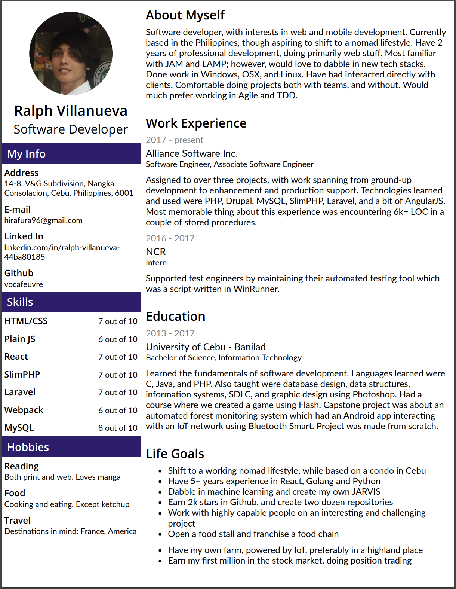

Hello again! It's been quite a while since I've updated my blog. Been busy the past couple of weeks trying
to build a real estate catalog web app for a potential customer. Building it in React was pure bliss. I've
always been a fan of the JS framework ever since I got introduced to it last year. I started my journey in React
here: [React Course in Codecademy](https://www.codecademy.com/learn/react-101). Having a great tutorial as a start made learning React a breeze through.

React made it easy for me to learn front end development. Considering that I came from a desktop dev background, I've always been intimidated by HTML and CSS. Dragging and dropping a component from the toolbox then coding the logic from there made sense to me. Structuring your view with markup and laying out the aesthetics with CSS was kinda hard to understand. Well, until now. You see, I've decided to take on HTML and CSS by creating things with them each day, for a hundred days. You can see my 100 days with HTML/CSS here: [100 Days of HTML/CSS](https://github.com/vocafeuvre/html-css-challenge). I haven't been coding HTML/CSS everyday due to my job, so I still have 97 days left (1 work = 1 day).

My latest work was to create an online resume, responsive in both screen and print. I first did it in pure HTML/CSS, then I ported it over to Gatsby so that I could expose it here. You can access it [here](https://vocalfever.netlify.com/resume). You can actually print it from Google, though you'd have to use A4 or Letter for the page size. Here's a screenshot of the PDF:

The page layout of that resume is actually different from the live one. I printed the PDF shown in the screenshot from the HTML/CSS challenge version. I had problems with the styling, with some stylesheet interfering with my own styles, that I had to do the print layout as a column. I did style the live one using CSS-in-JS using Emotion, but I'm sure the cause was something else.

I think coding your own resume instead of creating it in MS Word or some other tool is a good exercise for a developer. It does help to wow your future clients or partners starting from your resume and a hand coded one certainly will.
