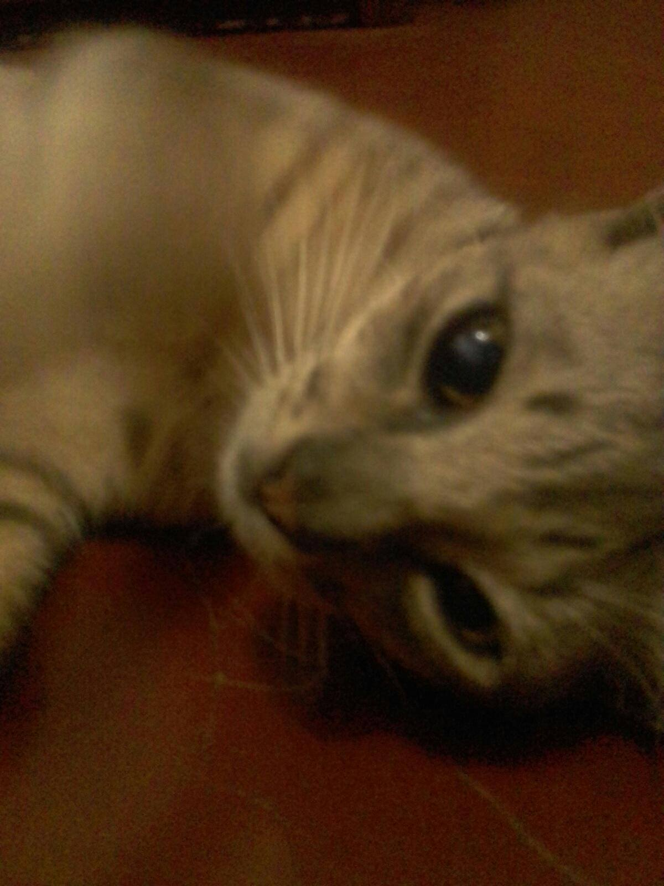

Hello World! As every programmer should always first output in every new endeavor (except 3D rendering, you have
the [Utah teapot](https://en.wikipedia.org/wiki/Utah_teapot) for that). 

Whew, it's my first post and I've already run out of things to say. Maybe an explanation as to why I put this up would do?
But before that, an offering to the internet gods should be made:

There! I'm sure the deities of the WWW are now appeased. Okay, the explanation. It won't be some long-winded story
about this and that. Heck, it's even shorter than the current paragraph. The thing is, ***I just want to be able to communicate properly.*** Writing blog posts seems to be a very good exercise for that.

I'm sure that for a very long time, the number of people who'll come by this blog can be counted with one hand. Doesn't matter anyway, I'm not into this for the traffic. Nevertheless, if you happened to chance upon this blog while surfing the net, thank you! Thank you for gracing my blog with your presence.

A little bit more detail about me before I end this: I'm currently writing this to the music of Studio Ghibli jazzified, and I just found out that my profile pic (which I randomly found as an album cover for Vocaloid a long time ago) was made by this guy - [vubaohandn](https://www.zerochan.net/user/vubaohandn). He/she draws really good, here's the [link](https://www.zerochan.net/1487780) to the uncompressed photo, the way Hatsune Miku and IA are drawn is amazing. I'd have to make another profile pic though. As much as I really like the art, it's somebody else's property and I wouldn't want to take it away from them.

To end my first post, I'd like to borrow the words of the guy whose gatsby starter I used to kickstart this blog:

> I'm sure I'll write a lot more interesting things in the future.

Thanks very much to Kyle Matthews for this awesome Gatsby blog template! And for Gatsby too!

